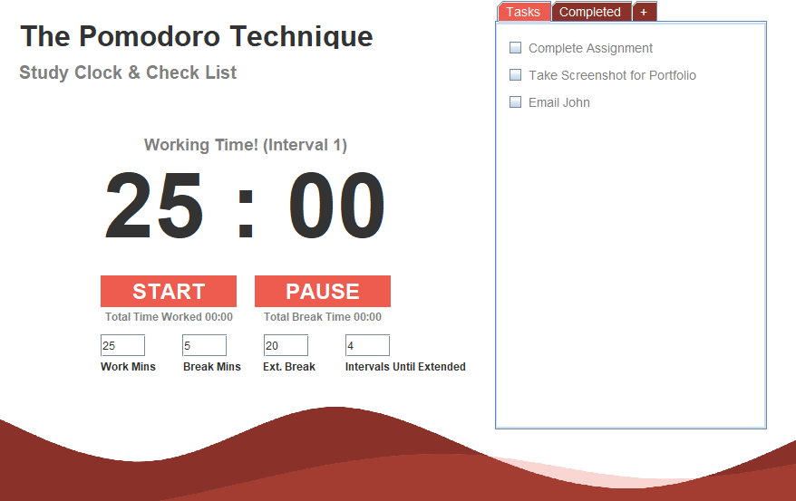

# Fall-Hacks-2022 C1
Aiden Carelse &amp; Wilson Agyapong's submission for SFU's Fall Hacks 2022. Team ID: C1.

Fall Hacks 2022, October 15th, 2022

We developed a study timer and check list application using the programming language Java. We decided to base our project on the popular
proven study method "Pomodoro" where a student studies for a set amount of time and takes a break for a set amount of time to allow
maximum focus. Our app allows people to input the amount of time they want to work and take breaks, along with how long before their extended break should be. We also have a checklist, which allows people to add tasks to a list, and mark them as completed.
This app is useful for students seeking productivity and those who find it hard to study for hours upon end.

We used Java Swing on IntelliJ (JDK 18.0.1). You can clone this repository to your machine and run it by simply choosing the main file in MainApplication on startup.

This was both of our first hackatahon, and we had a blast, thank you SFU!

